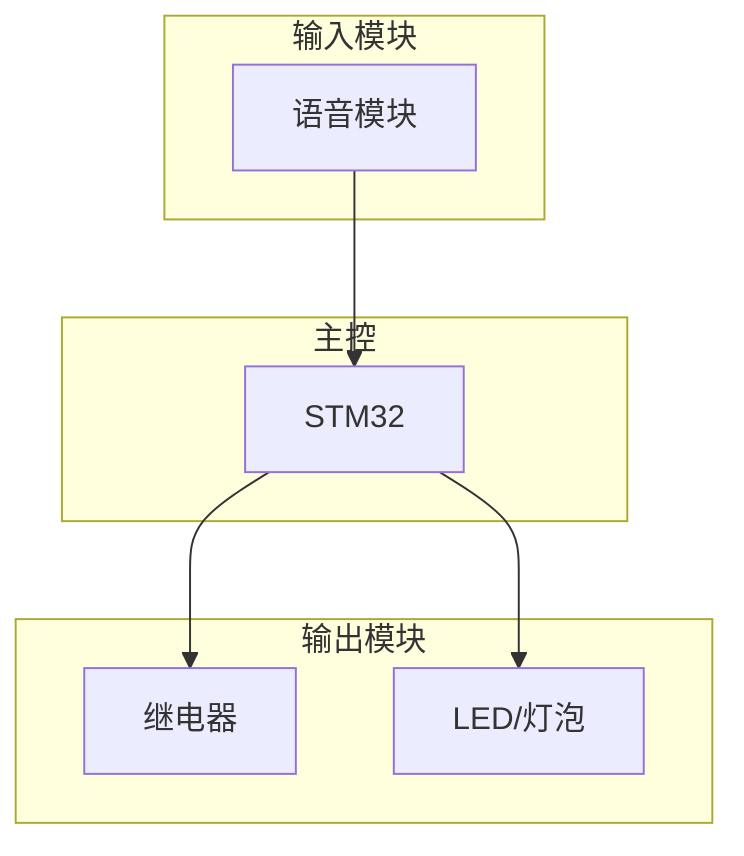
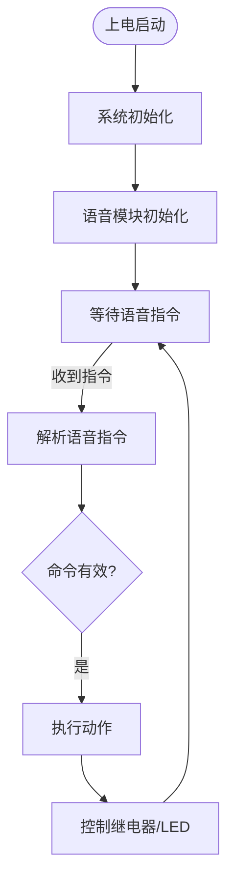

# Diagram Agent

当用户提出嵌入式项目需求时（如"声控开灯"），自动生成可视化图表（架构图、接线图、流程图）帮助理解和实现项目。

## 目录结构

```
diagram-agent/
├── index.js                          # 主入口
├── skills/
│   └── diagram-generator/
│       ├── skill.md                  # Skill 定义
│       └── handlers/
│           ├── architecture.js       # 系统架构图生成（Mermaid）
│           ├── wiring.js             # 硬件接线图生成（HTML）
│           └── flowchart.js          # 软件流程图生成（Mermaid）
├── hooks/
│   └── detect-project-hook.js         # 需求检测 Hook
├── agents/
│   └── diagram-agent.js              # 调度 Agent
└── docs/
    └── plans/
        └── 2026-05-01-diagram-design.md
```

## 触发方式

### 自动触发（需配置 Hook）

在 `settings.json` 中配置 Hook：

```json
{
  "hooks": {
    "onUserMessage": [
      {
        "name": "detect-project-hook",
        "description": "检测项目需求并触发图表生成",
        "scriptPath": "C:/Users/ROG/.claude/skills/diagram-agent/hooks/detect-project-hook.js"
      }
    ]
  }
}
```

### 手动触发

用户说："生成架构图" 或 "帮我生成图片" 等明确指令。

## 使用示例

用户输入：
```
我要实现一个声控开灯的项目
```

AI 自动生成：
```
docs/diagrams/声控开灯/
├── architecture.mmd        # 系统架构图（Mermaid 源码）
├── wiring.html             # 硬件接线图（HTML，AI 可编辑）
├── wiring_preview.html     # 浏览器预览版
└── flowchart.mmd           # 软件流程图（Mermaid 源码）
```

## 生成的图表

### 1. 系统架构图 (architecture.mmd)



### 2. 硬件接线图 (wiring.html)

HTML + CSS 格式的接线图，包含：
- 模块方框和引脚标注
- 可编辑的表格（contenteditable）
- 接线说明注释

### 3. 软件流程图 (flowchart.mmd)



## API

### `processDemand({ message, projectPath })`

处理用户需求，生成图表。

```javascript
const { processDemand } = require('./diagram-agent/index.js');

const result = await processDemand({
  message: '我要实现一个声控开灯的项目',
  projectPath: 'F:/path/to/project'
});
```

## 与 stm32_master 的集成

此模块为独立模块，可与 stm32_master 配合使用：

1. 用户描述项目需求 → Diagram Agent 生成图表
2. 图表辅助理解项目 → stm32_master 编译/烧录/调试

## 技术栈

- **Mermaid**：生成流程图、架构图（文本格式，AI 可改）
- **HTML+CSS**：生成接线图/原理图（可交互编辑）
- **纯 JavaScript**：无外部依赖