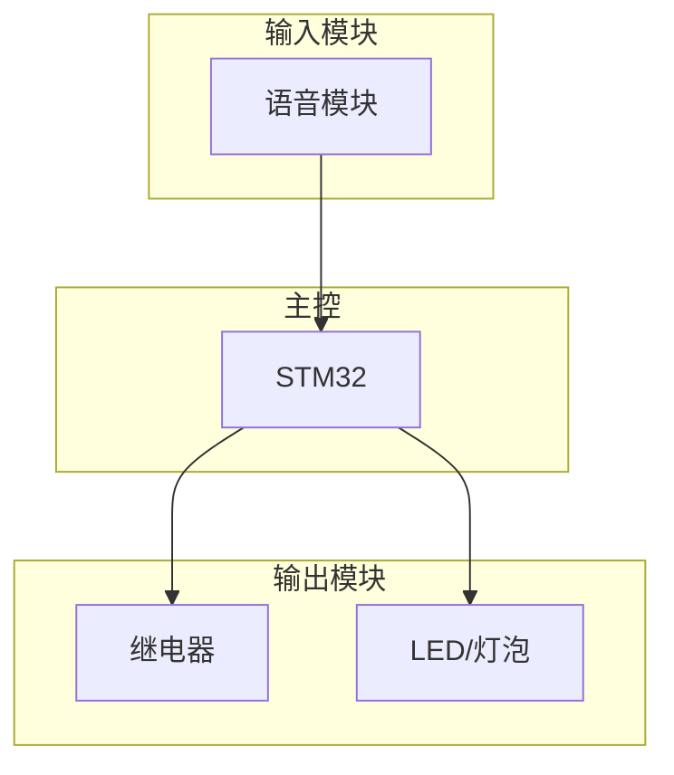

# Diagram Agent

当用户提出嵌入式项目需求时（如"声控开灯"），自动生成可视化图表（架构图、接线图、流程图）帮助理解和实现项目。

## 目录结构

```
diagram-master/
├── index.js                          # 主入口
├── orchestrator.js                   # 工作流编排器（状态管理、断点续跑）
├── config.json                       # 用户配置（输出目录等）
├── skills/
│   └── diagram-generator/
│       ├── skill.md                  # Skill 定义
│       ├── wiring-editor.html        # 交互式接线图编辑器（拖拽、连线、导出）
│       └── handlers/
│           ├── architecture.js       # 系统架构图生成（Mermaid）
│           ├── wiring.js             # 硬件接线图 + 编辑器生成（HTML）
│           └── flowchart.js          # 软件流程图生成（Mermaid）
├── hooks/
│   └── detect-project-hook.js         # 需求检测 Hook
├── agents/
│   └── diagram-agent.js              # 调度 Agent
├── tests/                            # 测试用例
└── docs/
    └── plans/
        └── 2026-05-01-diagram-design.md
```

独立 skill（`~/.claude/skills/requirements-master/`）：

```text
requirements-master/
├── SKILL.md                          # Skill 定义
├── index.js                          # API 入口
├── prompt.js                         # AI 推理提示词
└── parser.js                         # 需求解析器
```

## 触发方式

### 自动触发（需配置 Hook）

在 `settings.json` 中配置 Hook：

```json
{
  "hooks": {
    "onUserMessage": [
      {
        "name": "detect-project-hook",
        "description": "检测项目需求并触发图表生成",
        "scriptPath": "C:/Users/ROG/.claude/skills/diagram-master/hooks/detect-project-hook.js"
      }
    ]
  }
}
```

### 手动触发

用户说："生成架构图" 或 "帮我生成图片" 等明确指令。

## 使用示例

用户输入：
```
我要实现一个声控开灯的项目
```

AI 自动生成（编辑器优先）：

输出到 config.json 中指定的目录（默认 `C:/Users/ROG/Desktop/WORK/嵌入式大师工作流/`），按项目名分子目录：

```text
<outputDir>/声控开灯/
├── requirements.json       # 结构化需求数据
├── requirements.md         # 人类可读需求文档
├── wiring_editor.html      # 交互式接线图编辑器（预填充模块，可拖拽编辑）★主要输出
├── wiring.html             # 静态接线图（HTML，可编辑表格）
├── wiring_preview.html     # 接线图预览版
├── architecture.mmd        # 系统架构图（Mermaid 源码）
└── flowchart.mmd           # 软件流程图（Mermaid 源码）
```

## 生成的图表

### 1. 系统架构图 (architecture.mmd)



### 2. 交互式接线图编辑器 (wiring_editor.html) ★主要输出

完整的可视化编辑器，包含：
- 模块库侧边栏（MCU/输入/输出/通信四大类，30+ 模块）
- 拖拽放置模块到画布，支持网格吸附（20px）
- 点击引脚自动连线，SVG 贝塞尔曲线渲染
- 撤销/重做（Ctrl+Z/Y），最多 50 步历史
- 连线验证（GND-GND、电源-信号检查）
- 属性面板（可编辑模块名、位置、引脚值）
- 接线总览面板（所有连接一目了然）
- 导出为 HTML / Mermaid / JSON / Markdown
- 离线可用（无外部依赖）
- 预填充：根据 requirements.json 自动放置模块并连线

### 3. 软件流程图 (flowchart.mmd)


## 完整工作流

```
用户想法 → [编排器] → Phase 1 需求澄清 → Phase 2 图表生成 → Phase 3 代码烧录
```

### Phase 1: 需求澄清（requirements-master）
- AI 内部推理 2 轮，向用户提 2-3 个关键问题
- 输出 `requirements.md` + `requirements.json`

### Phase 2: 图表生成（diagram-master，编辑器优先）
- 接收 requirements.json
- **首先**生成交互式接线图编辑器（wiring_editor.html），预填充模块和连线
- **然后**生成架构图和流程图作为参考
- 用户在编辑器中调整接线方案，导出确认

### Phase 3: 代码开发（stm32_master）
- 编译 → 烧录 → 调试 → 测试

### 断点续跑
工作流状态保存在 `workflow-state.json`，支持从任意阶段恢复。

## API

### `processDemand({ message, projectPath })`

处理用户需求，生成图表。

```javascript
const { processDemand } = require('./index.js');

const result = await processDemand({
  message: '我要实现一个声控开灯的项目',
  projectPath: 'F:/path/to/project'
});
```

### `orchestrate({ message, projectPath })`

编排完整工作流（Phase 1 → Phase 2 → Phase 3），支持断点续跑。

```javascript
const { orchestrate } = require('./index.js');

const result = await orchestrate({
  message: '用STM32做感应灯',
  projectPath: 'F:/path/to/project'
});
```

## 与 stm32_master 的集成

完整工作流的三个阶段：

1. **Phase 1** — 用户描述项目需求 → requirements-master 生成结构化需求文档
2. **Phase 2** — diagram-master 根据需求生成图表（架构图、接线图、流程图）
3. **Phase 3** — stm32_master 编译/烧录/调试

使用 `orchestrate()` 可自动编排三个阶段，或手动调用各阶段。

## 技术栈

- **Mermaid**：生成流程图、架构图（文本格式，AI 可改）
- **HTML+CSS**：生成接线图/原理图（可交互编辑）
- **纯 JavaScript**：无外部依赖