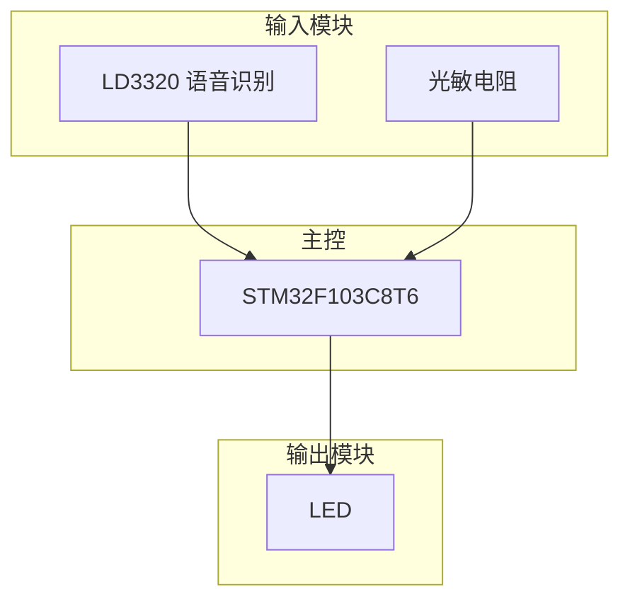
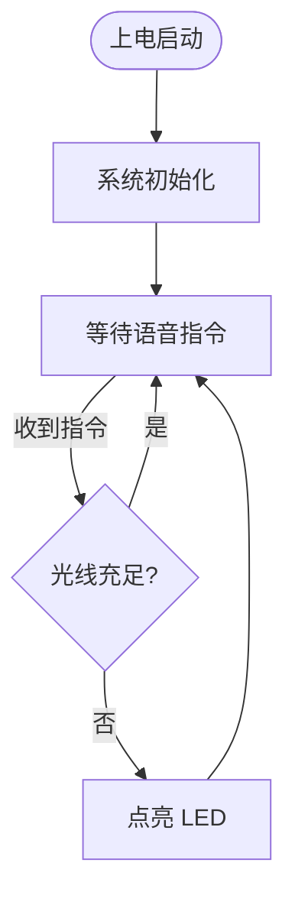

# 嵌入式工作流-②效果呈现大师

> 根据结构化需求自动生成交互式接线图、系统架构图、软件流程图的可视化引擎

---

## 它做什么

接收 ①需求分析大师 输出的 `requirements.json`，自动生成三类可视化图表，其中**交互式接线图编辑器**是核心输出。

```
requirements.json
        ↓
┌─────────────────────────────────────┐
│  系统架构图 (architecture.mmd)       │  Mermaid 文本格式
│  交互式接线图编辑器 (wiring_editor.html)  ★ 主要输出
│  静态接线图 (wiring.html)            │  HTML 表格版
│  软件流程图 (flowchart.mmd)          │  Mermaid 文本格式
└─────────────────────────────────────┘
```

## 核心能力

### 交互式接线图编辑器（★ 主要输出）

完整的可视化编辑器，无需安装，浏览器直接打开：

| 功能 | 说明 |
|------|------|
| **模块库** | 30+ 预置模块（MCU/传感器/显示屏/电机驱动/通信模块） |
| **拖拽编辑** | 拖放模块到画布，支持网格吸附（20px） |
| **自动连线** | 根据 requirements.json 自动放置模块并连线 |
| **智能匹配** | 4 级匹配策略：精确名称 → 中文标签 → 包含匹配 → 接口类型 |
| **引脚连线** | 点击引脚自动连线，SVG 贝塞尔曲线渲染 |
| **连线方向** | R 键切换引出方向，起点/终点独立控制 |
| **模块翻转** | F 键左右翻转模块 |
| **画布操作** | 滚轮缩放、Space+拖拽/中键平移 |
| **撤销重做** | Ctrl+Z/Y，最多 50 步历史 |
| **连线验证** | GND-GND、电源-信号检查 |
| **属性面板** | 编辑模块名、位置、引脚值，查看连线信息 |
| **接线总览** | 所有连接一目了然 |
| **导出** | HTML / Mermaid / JSON / Markdown 四种格式 |
| **主题** | 亮色/暗色切换 |
| **离线可用** | 无外部依赖，单文件 HTML |

### 系统架构图

Mermaid 格式，展示模块层级关系：



### 软件流程图

Mermaid 格式，展示程序逻辑：



## 输出文件

| 文件 | 格式 | 说明 |
|------|------|------|
| `wiring_editor.html` | HTML | ★ 交互式接线图编辑器（预填充模块和连线） |
| `wiring.html` | HTML | 静态接线图（可编辑表格版） |
| `wiring_preview.html` | HTML | 接线图预览版 |
| `architecture.mmd` | Mermaid | 系统架构图源码 |
| `flowchart.mmd` | Mermaid | 软件流程图源码 |

## 模块匹配流程

```
需求中的模块 → 读取编辑器模块库
                    ↓
        ┌── 匹配成功 → 使用现有模块，自动连线
        └── 匹配失败 → AI 自动生成模块定义，永久写入模板
```

新创建的模块会永久保存到编辑器模板，后续项目可直接复用。

## 使用方式

### 自动触发

描述项目需求后自动启动：
```
我要做一个声控灯的项目
```

### 手动触发

基于已有的 requirements.json 生成图表：
```javascript
const { generate } = require('./skills/diagram-generator/handlers/wiring.js');
generate({ requirements, outputDir });
```

## 快捷键

| 快捷键 | 功能 |
|--------|------|
| R | 切换选中连线的起点引出方向 / 切换选中模块所有连线引出方向 |
| Shift+R | 切换选中连线的终点引出方向 |
| F | 翻转选中模块（左右镜像） |
| Delete | 删除选中模块或连线 |
| Ctrl+Z / Ctrl+Y | 撤销 / 重做 |
| Ctrl+S | 保存 |
| Ctrl+E | 导出面板 |
| Esc | 取消连线模式 / 取消选择 |
| 滚轮 | 缩放画布 |
| Space+拖拽 | 平移画布 |

## 技术架构

```
diagram-master/
├── index.js                              ← 主入口
├── orchestrator.js                       ← 工作流编排（状态管理、断点续跑）
├── agents/diagram-agent.js               ← 调度 Agent
├── hooks/detect-project-hook.js          ← 需求检测 Hook
└── skills/diagram-generator/
    ├── skill.md                          ← Skill 定义
    ├── wiring-editor.html                ← 交互式编辑器模板（30+ 模块定义）
    └── handlers/
        ├── architecture.js               ← 系统架构图（Mermaid）
        ├── wiring.js                     ← 接线图 + 编辑器生成
        └── flowchart.js                  ← 软件流程图（Mermaid）
```

- 纯 Node.js，零外部依赖
- 64 个单元测试全部通过

## 工作流位置

```
①需求分析大师 → ②效果呈现大师 → ③代码实现大师
 需求文档         (当前位置)         编译/烧录/调试
                 接线图/架构图
```

接收 ① 的 `requirements.json`，输出可视化图表供用户审阅确认，确认后交给 ③ 进行代码开发。
