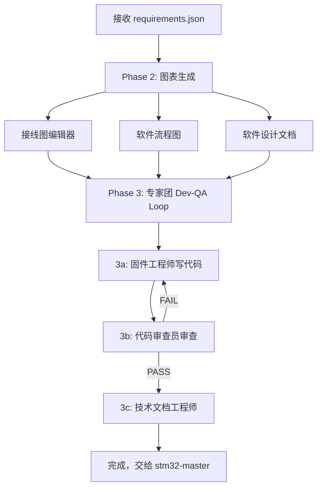

# 嵌入式工作流-②效果呈现大师

### 接线图 · 流程图 · 软件设计文档

---

> 根据 requirements.json 自动生成交互式接线图、系统架构图、软件流程图、软件设计文档

[它做什么](#它做什么) · [核心能力](#核心能力) · [输出文件](#输出文件) · [工作流](#工作流) · [技术架构](#技术架构)

---

## 它做什么

接收 `requirements.json`，自动生成四类可视化输出：

```
requirements.json
        ↓
┌──────────────────────────────────────────┐
│  交互式接线图编辑器 (wiring_editor.html)  ★ 主要输出
│  静态接线图 (wiring.html)
│  软件流程图 (flowchart.html)
│  软件设计文档 (software_design.md)
│  系统架构图 (architecture.mmd)
└──────────────────────────────────────────┘
```

## 核心能力

### 交互式接线图编辑器（★ 主要输出）

完整的可视化编辑器，无需安装，浏览器直接打开：

| 功能 | 说明 |
|------|------|
| **模块库** | 30+ 预置模块（MCU/传感器/显示屏/电机驱动/通信模块） |
| **拖拽编辑** | 拖放模块到画布，支持网格吸附（20px） |
| **自动连线** | 根据 requirements.json 自动放置模块并连线 |
| **智能匹配** | 4 级匹配策略：精确名称 → 中文标签 → 包含匹配 → 接口类型 |
| **引脚连线** | 点击引脚自动连线，SVG 贝塞尔曲线渲染 |
| **连线方向** | R 键切换引出方向，起点/终点独立控制 |
| **模块翻转** | F 键左右翻转模块 |
| **画布操作** | 滚轮缩放、Space+拖拽/中键平移 |
| **撤销重做** | Ctrl+Z/Y，最多 50 步历史 |
| **连线验证** | GND-GND、电源-信号检查 |
| **属性面板** | 编辑模块名、位置、引脚值，查看连线信息 |
| **接线总览** | 所有连接一目了然 |
| **导出** | HTML / Mermaid / JSON / Markdown 四种格式 |
| **主题** | 亮色/暗色切换 |
| **离线可用** | 无外部依赖，单文件 HTML |

### 软件设计文档

Markdown 格式，包含：
- 模块架构表（软件模块 → 对应硬件 → 职责）
- 初始化顺序（带接口细节）
- 主循环伪代码
- 关键函数清单
- 中断处理表
- 数据结构定义
- 推荐文件结构

### 专家团 Dev-QA Loop

Phase 3 的代码开发通过三个专家角色协作完成：

| 角色 | 职责 |
|------|------|
| 嵌入式固件工程师 | 基于 requirements + software_design 编写 STM32 代码 |
| 代码审查员 | 审查代码正确性/安全性/可维护性，FAIL → 回到工程师，最多 3 次 |
| 技术文档工程师 | 生成项目文档（README、接线说明、引脚表、调试指南） |

## 输出文件

| 文件 | 格式 | 说明 |
|------|------|------|
| `wiring_editor.html` | HTML | ★ 交互式接线图编辑器（预填充模块和连线） |
| `wiring.html` | HTML | 静态接线图（可编辑表格版） |
| `wiring_preview.html` | HTML | 接线图预览版 |
| `flowchart.html` | HTML | 软件流程图（初始化 + 主循环双图） |
| `software_design.md` | Markdown | 软件设计文档（模块架构、函数清单、文件结构） |
| `architecture.mmd` | Mermaid | 系统架构图源码 |

## 工作流

### 调用场景

本 skill 在两种场景下被调用：

**新建模式**（由 requirements-master 调用）：
```
requirements-master 生成 requirements.json
  → diagram-master 生成全部图表 + 专家团写代码
    → stm32-master 编译烧录
```

**迭代模式**（由 iteration-master 调用）：
```
iteration-master 合并需求，更新 requirements.json
  → diagram-master 重新生成受影响的图表
    → stm32-master 编译烧录
```

### 生成流程



## 模块匹配流程

```
需求中的模块 → 读取编辑器模块库
                    ↓
        ┌── 匹配成功 → 使用现有模块，自动连线
        └── 匹配失败 → AI 自动生成模块定义，永久写入模板
```

新创建的模块会永久保存到编辑器模板，后续项目可直接复用。

## 快捷键

| 快捷键 | 功能 |
|--------|------|
| R | 切换选中连线的起点引出方向 / 切换选中模块所有连线引出方向 |
| Shift+R | 切换选中连线的终点引出方向 |
| F | 翻转选中模块（左右镜像） |
| Delete | 删除选中模块或连线 |
| Ctrl+Z / Ctrl+Y | 撤销 / 重做 |
| Ctrl+S | 保存 |
| Ctrl+E | 导出面板 |
| Esc | 取消连线模式 / 取消选择 |
| 滚轮 | 缩放画布 |
| Space+拖拽 | 平移画布 |

## 技术架构

```
diagram-master/
├── index.js                              ← 主入口
├── orchestrator.js                       ← 工作流编排（状态管理、断点续跑）
├── agents/diagram-agent.js               ← 调度 Agent
├── agents/personas/                      ← 专家人格定义
│   ├── embedded-firmware-engineer.md     ← 固件工程师
│   ├── code-reviewer.md                  ← 代码审查员
│   └── technical-writer.md               ← 技术文档工程师
├── hooks/detect-project-hook.js          ← 需求检测 Hook
└── skills/diagram-generator/
    ├── skill.md                          ← Skill 定义
    ├── wiring-editor.html                ← 交互式编辑器模板（30+ 模块定义）
    └── handlers/
        ├── wiring.js                     ← 接线图 + 编辑器生成
        ├── flowchart.js                  ← 软件流程图（Mermaid）
        └── software_design.js            ← 软件设计文档
```

- 纯 Node.js，零外部依赖
- 84 个单元测试全部通过

## 工作流位置

```
embedded-pipeline（入口 + 目录选择 + 模式判断）
  │
  ├─ 新建模式 → ① requirements-master → ② diagram-master → ③ stm32-master
  │                                          (当前位置)
  │
  └─ 迭代模式 → iteration-master → ② diagram-master → ③ stm32-master
                                     (功能添加/硬件更换时调用)
```

本 skill 在**新建模式**和**迭代模式（功能添加/硬件更换）**下都会被调用。
